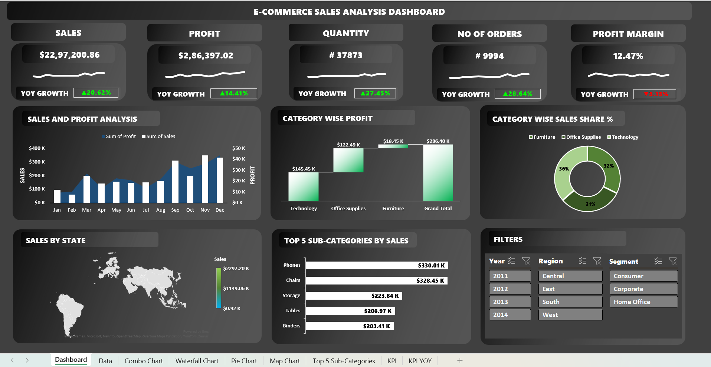
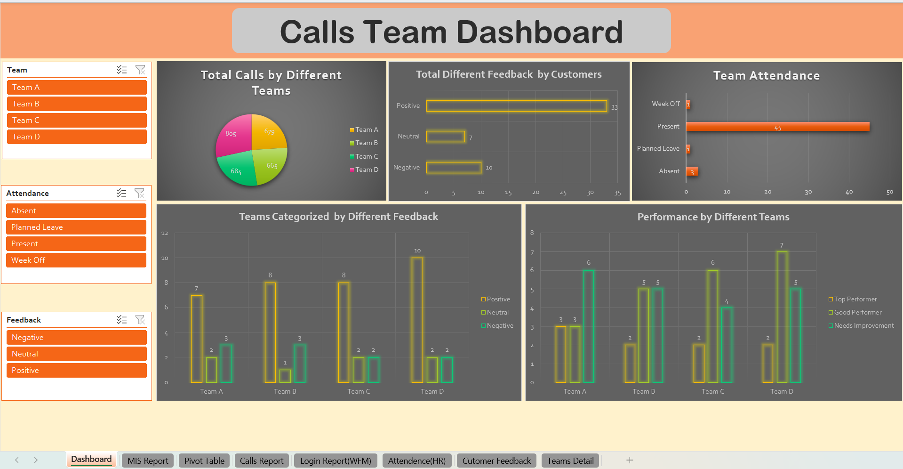
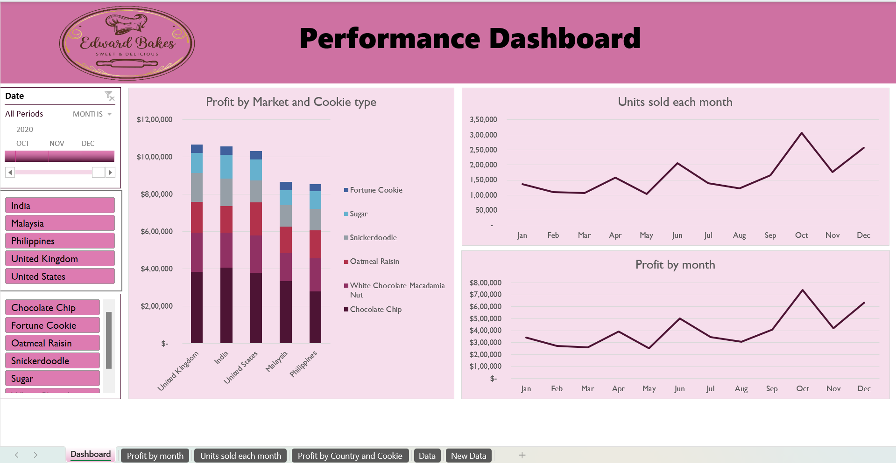

# Advanced MIS & Data Analytics Portfolio

A collection of professional Business Intelligence dashboards built using Excel. These projects demonstrate expertise in data transformation, automated reporting, and executive-level visualization.

---

## 1. E-Commerce Sales Analysis
**Key Features:** Geographic Map Charting, Waterfall Profit Analysis, and YOY Growth KPIs.

---

## 2. Calls Team Performance
**Key Features:** Operational KPI tracking, Workforce Management (WFM) metrics, and Customer Feedback analysis.

---

## 3. "Edward Bakes" Retail Dashboard
**Key Features:** Custom branding, product-level profit margins, and interactive sales timelines.

---

### Technical Skills Demonstrated:
* **Advanced Excel:** Pivot Tables, VLOOKUP/XLOOKUP, and Nested Logical Formulas (IF/IFS).
* **Data Visualization:** Slicers, Map Charts, Waterfall Charts, and Sparklines.
* **MIS Reporting:** Automated dashboard design with protected user interfaces.
* **Analytical Thinking:** Transforming raw datasets into actionable business insights.
